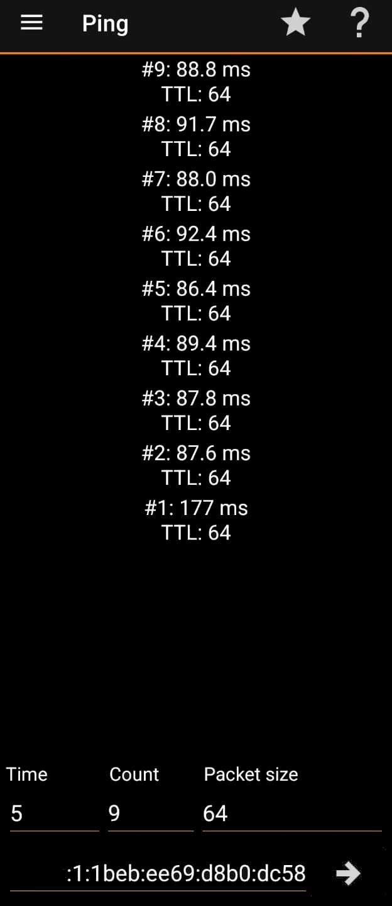
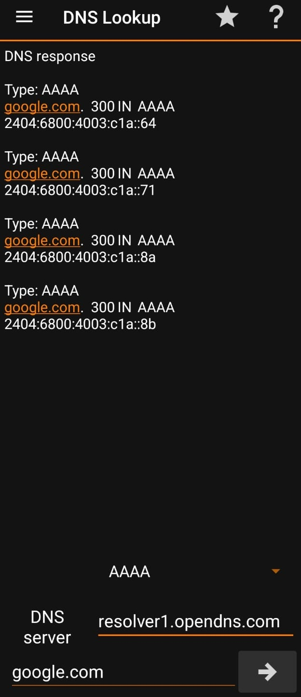
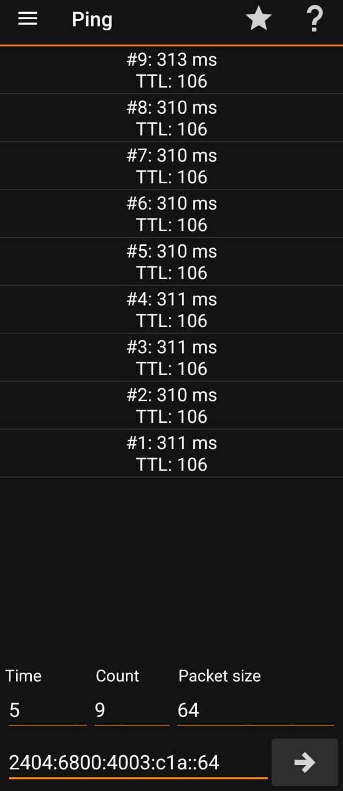

# MP-BGP EVPN-VXLAN with a combined spine/VTEP centralized gateway

 Overview

This project demonstrates working **MikroTik BGP EVPN-VXLAN deployment using an eBGP underlay and eBGP EVPN overlay** across multiple locations.

The main objective is to extend the same Layer-2 network between geographically separated sites, but it also use extra VXLAN VTEP in Spine node that play role as VXLAN gateway. This design realize final objective to use IPv6 connectivity (end to end) on endpoints connected under 2 Leaf routers and to exiting internet via DC site. 


# Architecture
<p align="center">
  
</p>

**IP Addressing info**

| Location    | Role                        |   ASN | Loopback / VTEP |
| ----------- | -------------------------   | ----: | --------------- |
| Data Center | EVPN Spine + VTEP + Gateway | 65501 | 10.200.200.1    |
| Site pog    | EVPN Leaf / VTEP            | 65502 | 10.200.200.10   |
| Site rent   | EVPN Leaf / VTEP            | 65503 | 10.200.200.20   |

 service info

| Parameter      | Value       |
| -------------- | ----------- |
| VLAN           | 8           |
| VNI            | 10008       |
| Import RT      | 10008:10008 |
| Export RT      | 10008:10008 |
| EVPN AFI       | `evpn`      |

# Underlay Configuration

Since the sites are far apart they are connected through IPIP over IPsec VPN. In my case underlay layer uses **eBGP** also but it can be any other like OSPF, ISIS or even static routing depend of topology like. The job of this layer is simple: It only provides IP connectivity required by the overlay to make every VTEP loopback reachable from every other VTEP.

Spine_DC

```routeros
/ip/address
add address=10.255.255.1/30 interface=vti-ipip-tunnel_rent comment="VTI to RENT"
add address=10.255.254.1/30 interface=vti-ipip-tunnel_pog comment="VTI to POG"
add address=10.200.200.1/32 interface=lo comment="EVPN VTEP Loopback"
```

Leaf_pog

```routeros
/ip/address
add address=10.255.254.2/30 interface=vti-ipip-tunnel2 comment="VTI to DC"
add address=10.200.200.10/32 interface=lo comment="EVPN VTEP Loopback"
```

Leaf_rent

```routeros
/ip/address
add address=10.255.255.2/30 interface=vti-ipip-tunnel_dc comment="VTI to DC"
add address=10.200.200.20/32 interface=lo comment="EVPN VTEP Loopback"
```

**Verify underlay connectivity**

```routeros
/routing/bgp/connection/print
```
results of BGP connections:
spine_dc
```text
0    name="bgp-to-rtr_int_pog" instance=bgp-instance-1 remote.address=10.255.254.2/32 .as=65502 local.address=10.255.254.1 .role=ebgp
     routing-table=main as=65501 multihop=yes afi=ip output.redistribute=connected,ospf,bgp
 
1    name="bgp-to-rtr_int_rent" instance=bgp-instance-1 remote.address=10.255.255.2/32 .as=65503 local.address=10.255.255.1 .role=ebgp
     routing-table=main as=65501 multihop=yes afi=ip output.redistribute=connected,ospf,bgp
```
leaf_pog
```text
0    name="bgp-to-rtr_int_dc" instance=bgp-instance-1 remote.address=10.255.254.1/32 .as=65501 local.address=10.255.254.2 .role=ebgp
     routing-table=main as=65502 multihop=yes afi=ip output.redistribute=connected
```
Leaf_rent
```text
0    name="bgp-to-rtr_int_dc" instance=bgp-instance-1 remote.address=10.255.255.1/32 .as=65501 local.address=10.255.255.2 .role=ebgp
     routing-table=main as=65503 multihop=yes afi=ip output.redistribute=connected
 ```

```routeros
/routing/route/print where dst-address~"10.200.200"
```
results of routes regarding lo addresses:
spine_dc
```text
   DST-ADDRESS                                GATEWAY        AFI   ROUTING-TABLE  DISTANCE  SCOPE  TARGET-SCOPE  IMMEDIATE-GW                     
Ac 10.200.200.1/32                            lo             ip    main                  0     10             5  lo                               
Ab 10.200.200.10/32                           10.255.254.2   ip    main                 20     40            30  10.255.254.2%vti-ipip-tunnel_pog 
Ab 10.200.200.20/32                           10.255.255.2   ip    main                 20     40            30  10.255.255.2%vti-ipip-tunnel_rent
```
leaf_pog
```text
   DST-ADDRESS                                GATEWAY        AFI   ROUTING-TABLE  DISTANCE  SCOPE  TARGET-SCOPE  IMMEDIATE-GW                 
Ab 10.200.200.1/32                            10.255.254.1   ip    main                 20     40            30  10.255.254.1%vti-ipip-tunnel2
Ac 10.200.200.10/32                           lo             ip    main                  0     10             5  lo                           
Ab 10.200.200.20/32                           10.255.254.1   ip    main                 20     40            30  10.255.254.1%vti-ipip-tunnel2
```
Leaf_rent
```text
   DST-ADDRESS                                GATEWAY        AFI   ROUTING-TABLE  DISTANCE  SCOPE  TARGET-SCOPE  IMMEDIATE-GW                 
Ab 10.200.200.1/32                            10.255.254.1   ip    main                 20     40            30  10.255.254.1%vti-ipip-tunnel2
Ac 10.200.200.10/32                           lo             ip    main                  0     10             5  lo                           
Ab 10.200.200.20/32                           10.255.254.1   ip    main                 20     40            30  10.255.254.1%vti-ipip-tunnel2
```
---
# BGP EVPN Overlay

For BGP overlay I have used multihop eBGP that uses loopback addresses.
BGP template is used to set common parameters and set connection to listen on all loopback address range, simplifying as much as it can and allow easy scalability.

Spine_DC

```routeros
/routing bgp instance
add as=65501 name=bgp-instance-evpn router-id=rid2
/routing bgp template
name=templ_evpn afi=evpn multihop=yes nexthop-choice=propagate
/routing bgp connection
add instance=bgp-instance-evpn local.address=10.200.200.1 .role=ebgp name=bgp_evpn_to_Leafs remote.address=10.200.200.0/24 templates=templ_evpn
```

Leaf_pog

```routeros
/routing bgp instance
add as=65502 name=bgp-instance-evpn router-id=rid2
/routing bgp connection
add afi=evpn instance=bgp-instance-evpn local.address=10.200.200.10 .role=ebgp  multihop=yes name=bgp_evpn_to_Spine remote.address=10.200.200.1
```

Leaf_rent

```routeros
/routing bgp instance
add as=65503 name=bgp-instance-evpn router-id=rid2
/routing bgp connection
add afi=evpn instance=bgp-instance-evpn local.address=10.200.200.20 .role=ebgp  multihop=yes name=bgp_evpn_to_Spine remote.address=10.200.200.1
```

**Verify BGP Connectivity**

Leaf_pog
```text
 E name="bgp_evpn_to_Spin-1" instance=bgp-instance-evpn remote.address=10.200.200.1 .as=65501 .id=10.200.200.1 .capabilities=mp,rr,enhe,gr,as4
     .afi=evpn .messages=1576 .bytes=30597 .eor="" local.address=10.200.200.10 .as=65502 .id=10.200.200.10 .cluster-id=10.200.200.10
     .capabilities=mp,rr,enhe,gr,as4 .afi=evpn .messages=1571 .bytes=30158 .eor="" output.procid=21 input.procid=21 ebgp multihop=yes hold-time=3m
     keepalive-time=1m uptime=1d2h5m16s610ms last-started=2026-09-24 13:43:31 prefix-count=2
```
Leaf_rent
```text
routing/bgp/session/print 
E name="bgp_evpn_to_Spine-1" instance=bgp-instance-evpn remote.address=10.200.200.1 .as=65501 .id=10.200.200.1 .capabilities=mp,rr,enhe,gr,as4
     .afi=evpn .messages=870 .bytes=16700 .eor="" local.address=10.200.200.20 .as=65503 .id=10.200.200.20 .cluster-id=10.200.200.20
     .capabilities=mp,rr,enhe,gr,as4 .afi=evpn .messages=869 .bytes=16594 .eor="" output.procid=22
     .last-notification=FFFFFFFFFFFFFFFFFFFFFFFFFFFFFFFF0015030400 input.procid=22 ebgp multihop=yes hold-time=3m keepalive-time=1m
     uptime=14h27m11s150ms last-started=2026-09-25 01:19:41 last-stopped=2026-09-25 01:19:19 prefix-count=2
```
---
# VXLAN and EVPN configuration

Leaf_pog

```routeros
/interface vxlan
add bridge=bridge_VLANs bridge-pvid=8 learning=no local-address=10.200.200.10 \
  mac-address=X:X:X:X:X:X mtu=1350 name=vxlan_10008 vni=10008
/routing bgp evpn
add export.route-targets=10008:10008 import.route-targets=10008:10008 \
    instance=bgp-instance-evpn name=bgp-evpn-vni10008 rd=10.200.200.10:10008 \
    vni=10008
```

Leaf_rent

```routeros
/interface vxlan
add bridge=bridge_VLANs bridge-pvid=8 learning=no local-address=10.200.200.20 \
   mac-address=X:X:X:X:X:X mtu=1350 name=vxlan_10008 vni=10008
/routing bgp evpn
add export.route-targets=10008:10008 import.route-targets=10008:10008 \
    instance=bgp-instance-evpn name=bgp-evpn-vni10008 rd=10.200.200.20:10008 \
    vni=10008
```

Since I specified from the beginning that this topology includes additional configuration, here is the VXLAN interface on the **Spine** node. The VLAN associated with this interface acts as the gateway for the IPv6 subnet. For sure there are other configs about routing and policy to have full operational IPv6 on DC that are not in scope here.

```routeros
/interface vxlan
add bridge=bridge_VLANs bridge-pvid=8 learning=no local-address=10.200.200.1 \
    loop-protect=on mac-address=X:X:X:X:X:X mtu=1350 name=vxlan_10008 \
    vni=10008
/routing bgp evpn
add export.route-targets=10008:10008 import.route-targets=10008:10008 \
    instance=bgp-instance-evpn name=bgp-evpn-vni10008 rd=10.200.200.1:10008 \
    vni=10008

/ipv6/address/print
 0  G 2001:X:X:X::1/64         vlan8                main     yes 
```

**Validate EVPN Service**

Verify IMET (Type-3) Routes and that vteps are discovered

DC

```text
routing/route/print where afi=evpn 
Flags: A - ACTIVE; b - BGP, e - EVPN
Columns: DST-ADDRESS, GATEWAY, AFI, DISTANCE, SCOPE, TARGET-SCOPE
   DST-ADDRESS                                GATEWAY        AFI   DISTANCE  SCOPE  TARGET-SCOPE
 e [10.200.200.1:10008]imet:0|10.200.200.1    10.200.200.1   evpn       200     40            10
Ab [10.200.200.10:10008]imet:0|10.200.200.10  10.200.200.10  evpn        20     40            30
Ab [10.200.200.20:10008]imet:0|10.200.200.20  10.200.200.20  evpn        20     40            30

/interface/vxlan/vteps/print 
Flags: D - DYNAMIC
Columns: INTERFACE, REMOTE-IP
#   INTERFACE    REMOTE-IP    
0 D vxlan_10008  10.200.200.10
1 D vxlan_10008  10.200.200.20
```
pog

```text
routing/route/print where afi=evpn 
Flags: A - ACTIVE; b - BGP, e - EVPN
Columns: DST-ADDRESS, GATEWAY, AFI, DISTANCE, SCOPE, TARGET-SCOPE, IMMEDIATE-GW
   DST-ADDRESS                                GATEWAY        AFI   DISTANCE  SCOPE  TARGET-SCOPE  IMMEDIATE-GW      
Ab [10.200.200.1:10008]imet:0|10.200.200.1    10.200.200.1   evpn        20     40            30  192.168.1.1%ether1
 e [10.200.200.10:10008]imet:0|10.200.200.10  10.200.200.10  evpn       200     40            10                    
Ab [10.200.200.20:10008]imet:0|10.200.200.20  10.200.200.20  evpn        20     40            30  192.168.1.1%ether1

/interface/vxlan/vteps/print 
Flags: D - DYNAMIC
Columns: INTERFACE, REMOTE-IP
#   INTERFACE    REMOTE-IP    
0 D vxlan_10008  10.200.200.1 
1 D vxlan_10008  10.200.200.20
```

rent

```text
routing/route/print where afi=evpn 
Flags: A - ACTIVE; b - BGP, e - EVPN
Columns: DST-ADDRESS, GATEWAY, AFI, DISTANCE, SCOPE, TARGET-SCOPE, IMMEDIATE-GW
   DST-ADDRESS                                GATEWAY        AFI   DISTANCE  SCOPE  TARGET-SCOPE  IMMEDIATE-GW      
Ab [10.200.200.1:10008]imet:0|10.200.200.1    10.200.200.1   evpn        20     40            30  192.168.2.1%ether2
Ab [10.200.200.10:10008]imet:0|10.200.200.10  10.200.200.10  evpn        20     40            30  192.168.2.1%ether2
 e [10.200.200.20:10008]imet:0|10.200.200.20  10.200.200.20  evpn       200     40            10 

/interface/vxlan/vteps/print 
Flags: D - DYNAMIC
Columns: INTERFACE, REMOTE-IP
#   INTERFACE    REMOTE-IP    
0 D vxlan_10008  10.200.200.1 
1 D vxlan_10008  10.200.200.10    
```
---

Hosts are connected on each site to Wi-Fi where these interfaces pointing to bridge with PVID 8 (VNI 10008).
At this point I'm pinging Host1 from Host2.

pog

MAC of my Host1: 74:D0:82:67:34:97

rent

MAC of my Host2: 60:6D:3C:FC:45:67

<p align="center">
  
</p>

We can see that EVPN is used to learn remote MAC addresses by looking at MACIP routes.

pog
```text
routing/route/print where dst-address~"macip"
Flags: A - ACTIVE; b - BGP, e - EVPN
Columns: DST-ADDRESS, GATEWAY, AFI, DISTANCE, SCOPE, TARGET-SCOPE, IMMEDIATE-GW
   DST-ADDRESS                                     GATEWAY        AFI   DISTANCE  SCOPE  TA  IMMEDIATE-GW      
 e [10.200.200.10:10008]macip:0|74:D0:82:67:34:97  10.200.200.10  evpn       200     40  10                    
Ab [10.200.200.20:10008]macip:0|60:6D:3C:FC:45:67  10.200.200.20  evpn        20     40  30  192.168.1.1%ether1
```
rent
```text
routing/route/print where dst-address~"macip"
Flags: A - ACTIVE; b - BGP, e - EVPN
Columns: DST-ADDRESS, GATEWAY, AFI, DISTANCE, SCOPE, TARGET-SCOPE, IMMEDIATE-GW
   DST-ADDRESS                                     GATEWAY        AFI   DISTANCE  SCOPE  TARGET-SCOPE  IMMEDIATE-GW      
Ab [10.200.200.10:10008]macip:0|74:D0:82:67:34:97  10.200.200.10  evpn        20     40            30  192.168.2.1%ether2
 e [10.200.200.20:10008]macip:0|60:6D:3C:FC:45:67  10.200.200.20  evpn       200     40            10   
```

What is most important in my case is that both these MAC are learned also in **DC**. 

```text
routing/route/print where dst-address~"macip"
Flags: A - ACTIVE; b - BGP
Columns: DST-ADDRESS, GATEWAY, AFI, DISTANCE, SCOPE, TARGET-SCOPE
   DST-ADDRESS                                     GATEWAY        AFI   DISTANCE  SCOPE  TARGET-SCOPE
Ab [10.200.200.10:10008]macip:0|74:D0:82:67:34:97  10.200.200.10  evpn        20     40            30
Ab [10.200.200.20:10008]macip:0|60:6D:3C:FC:45:67  10.200.200.20  evpn        20     40            30
```
---

Hosts get IPv6 address as below, and are able to exit Internet through DC site.

```text
/ipv6/neighbor/print where mac-address~"34:97"       
Flags: D - DYNAMIC
Columns: ADDRESS, MAC-ADDRESS, INTERFACE, VRF, STATUS
#   ADDRESS                              MAC-ADDRESS        INTERFACE  VRF   STATUS   
1 D X:X:X:1:1beb:ee69:d8b0:dc58  74:D0:82:67:34:97  vlan8      main  reachable
```

```text
/ipv6/neighbor/print where mac-address~"45:67"
Flags: D - DYNAMIC
Columns: ADDRESS, MAC-ADDRESS, INTERFACE, VRF, STATUS
#   ADDRESS                              MAC-ADDRESS        INTERFACE  VRF   STATUS   
4 D X:X:X:1:791e:7213:410d:3858  60:6D:3C:FC:45:67  vlan8      main  reachable
```

<p align="center">
  
  
</p>
